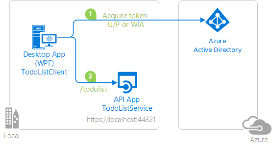

# Authenticating to Azure AD non-interactively using a username & password or Windows Integrated Authentication


## About this sample

### Scenario

This sample demonstrates a .Net console application calling a web API that is secured using Azure AD. the application does not require user interaction through a Web browser:



1. The .Net application uses the Active Directory Authentication Library (ADAL) to obtain a JWT access token through the OAuth 2.0 protocol.
2. The access token is sent to the web API to authenticate the user.

This sample shows you how to use ADAL to authenticate users via **raw credentials** (username and password, or Windows-integrated authentication) via a text-only interface. Information is available in the ADAL.NET conceptual documentation in [Acquiring tokens with username and password](https://github.com/AzureAD/azure-activedirectory-library-for-dotnet/wiki/Acquiring-tokens-with-username-and-password) and [AcquireTokenSilentAsync using Integrated authentication on Windows (Kerberos)](https://github.com/AzureAD/azure-activedirectory-library-for-dotnet/wiki/AcquireTokenSilentAsync-using-Integrated-authentication-on-Windows-(Kerberos))

### More information about protocols

For more information about how the protocols work in this scenario and other scenarios, see [Authentication Scenarios for Azure AD](https://azure.microsoft.com/documentation/articles/active-directory-authentication-scenarios/).

> Looking for previous versions of this code sample? Check out the tags on the [releases](../../releases) GitHub page.

## How To Run This Sample

> [!Note] If you want to run this sample on **Azure Government**, navigate to the "Azure Government Deviations" section at the bottom of this page.

To run this sample, you'll need:

- [Visual Studio 2017](https://aka.ms/vsdownload)
- An Internet connection
- An Azure Active Directory (Azure AD) tenant. For more information on how to get an Azure AD tenant, see [How to get an Azure AD tenant](https://azure.microsoft.com/en-us/documentation/articles/active-directory-howto-tenant/)
- A user account in your Azure AD tenant. This sample will not work with a Microsoft account (formerly Windows Live account). Therefore, if you signed in to the [Azure portal](https://portal.azure.com) with a Microsoft account and have never created a user account in your directory before, you need to do that now.

### Step 1:  Clone or download this repository

From your shell or command line:

`git clone https://github.com/Azure-Samples/active-directory-dotnet-native-headless.git`

> Given that the name of the sample is pretty long, and so are the name of the referenced NuGet pacakges, you might want to clone it in a folder close to the root of your hard drive, to avoid file size limitations on Windows.

### Step 2:  Register the sample with your Azure Active Directory tenant and configure the code accordingly

There are two projects in this sample. Each needs to be separately registered in your Azure AD tenant. To register these projects, you can:

- either follow the steps in the paragraphs below ([Step 2](#step-2--register-the-sample-with-your-azure-active-directory-tenant) and [Step 3](#step-3--configure-the-sample-to-use-your-azure-ad-tenant))
- or use PowerShell scripts that:
  - **automatically** create for you the Azure AD applications and related objects (passwords, permissions, dependencies)
  - modify the Visual Studio projects' configuration files.

If you want to use this automation, read the instructions in [App Creation Scripts](./AppCreationScripts/AppCreationScripts.md)

#### First step: choose the Azure AD tenant where you want to create your applications

As a first step you'll need to:

1. Sign in to the [Azure portal](https://portal.azure.com).
1. On the top bar, click on your account, and then on **Switch Directory**.
1. Once the *Directory + subscription* pane opens, choose the Active Directory tenant where you wish to register your application, from the *Favorites* or *All Directories* list.
1. Click on **All services** in the left-hand nav, and choose **Azure Active Directory**.

> In the next steps, you might need the tenant name (or directory name) or the tenant ID (or directory ID). These are presented in the **Properties**
of the Azure Active Directory window respectively as *Name* and *Directory ID*

#### Register the service app (TodoListService-Headless)

1. In the  **Azure Active Directory** pane, click on **App registrations** and choose **New application registration**.
1. Enter a friendly name for the application, for example 'TodoListService-Headless' and select 'Web app / API' as the *Application Type*.
1. For the *Sign-on URL*, enter the base URL for the sample. By default, this sample uses `https://localhost:44321`.
1. Click **Create** to create the application.
1. In the succeeding page, Find the *Application ID* value and record it for later. You'll need it to configure the Visual Studio configuration file for this project.
1. Then click on **Settings**, and choose **Properties**.
1. For the App ID URI, replace the guid in the generated URI 'https://\<your_tenant_name\>/\<guid\>', with the name of your service, for example, 'https://\<your_tenant_name\>/TodoListService-Headless' (replacing `<your_tenant_name>` with the name of your Azure AD tenant)

#### Register the client app (TodoListClient-Headless)

1. In the  **Azure Active Directory** pane, click on **App registrations** and choose **New application registration**.
1. Enter a friendly name for the application, for example 'TodoListClient-Headless' and select 'Native' as the *Application Type*.
1. For the *Redirect URI*, enter `https://<your_tenant_name>/TodoListClient-Headless`, replacing `<your_tenant_name>` with the name of your Azure AD tenant.
1. Click **Create** to create the application.
1. In the succeeding page, Find the *Application ID* value and record it for later. You'll need it to configure the Visual Studio configuration file for this project.
1. Then click on **Settings**, and choose **Properties**.
1. Configure Permissions for your application. To that extent, in the Settings menu, choose the 'Required permissions' section and then,
   click on **Add**, then **Select an API**, and type `TodoListService-Headless` in the textbox. Then, click on  **Select Permissions** and select **Access 'TodoListService-Headless'**.
1. Still in the *Required Permissions* panel, press **Grant Permissions**

### Step 3:  Configure the sample to use your Azure AD tenant

In the steps below, "ClientID" is the same as "Application ID" or "AppId".

Open the solution in Visual Studio to configure the projects

#### Configure the service project

1. Open the `TodoListService\Web.Config` file
1. Find the app key `ida:Tenant` and replace the existing value with your Azure AD tenant name.
1. Find the app key `ida:Audience` and replace the existing value with the App ID URI you registered earlier for the TodoListService-Headless app. For instance use `https://<your_tenant_name>/TodoListService-Headless`, where `<your_tenant_name>` is the name of your Azure AD tenant.

#### Configure the client project

1. Open the `TodoListClient\App.Config` file
1. Find the app key `ida:Tenant` and replace the existing value with your Azure AD tenant name.
1. Find the app key `ida:ClientId` and replace the existing value with the application ID (clientId) of the `TodoListClient-Headless` application copied from the Azure portal.
1. Find the app key `todo:TodoListResourceId` and replace the existing value with the App ID URI you registered earlier for the TodoListService-Headless app. For instance use `https://<your_tenant_name>/TodoListService-Headless`, where `<your_tenant_name>` is the name of your Azure AD tenant.
1. Find the app key `todo:TodoListBaseAddress` and replace the existing value with the base address of the TodoListService-Headless project (by default `https://localhost:44321`).

### Step 4: Run the sample

Clean the solution, rebuild the solution, and run it.  You might want to go into the solution properties and set both projects as startup projects, with the service project starting first.

Type the command `add`. You will be prompted for your username and password. Enter them, then enter the description a new todo. That done, type the command `list`. You will see that the command executes without prompting you again. You can clear the token cache by typing `clear`, and leave the client by typing `exit`.
Notice that if you stop the application without clearing the cache, the next time you run the application you won't be prompted to sign in again - that is the sample implements a persistent cache for ADAL, and remembers the tokens from the previous run.

## How to deploy this sample to Azure

This project has one WebApp / Web API projects. To deploy them to Azure Web Sites, you'll need, for each one, to:

- create an Azure Web Site
- publish the Web App / Web APIs to the web site, and
- update its client(s) to call the web site instead of IIS Express.

### Create and publish the `TodoListService-Headless` to an Azure Web Site

1. Sign in to the [Azure portal](https://portal.azure.com).
2. Click **Create a resource** in the top left-hand corner, select **Web + Mobile** --> **Web App**, select the hosting plan and region, and give your web site a name, for example, `TodoListService-Headless-contoso.azurewebsites.net`.  Click Create Web Site.
3. Once the web site is created, click on it to manage it.  For this set of steps, download the publish profile by clicking **Get publish profile** and save it.  Other deployment mechanisms, such as from source control, can also be used.
4. Switch to Visual Studio and go to the TodoListService-Headless project.  Right click on the project in the Solution Explorer and select **Publish**.  Click **Import Profile** on the bottom bar, and import the publish profile that you downloaded earlier.
5. Click on **Settings** and in the `Connection tab`, update the Destination URL so that it is https, for example [https://TodoListService-Headless-contoso.azurewebsites.net](https://TodoListService-Headless-contoso.azurewebsites.net). Click Next.
6. On the Settings tab, make sure `Enable Organizational Authentication` is NOT selected.  Click **Save**. Click on **Publish** on the main screen.
7. Visual Studio will publish the project and automatically open a browser to the URL of the project.  If you see the default web page of the project, the publication was successful.

### Update the Active Directory tenant application registration for `TodoListService-Headless`

1. Navigate to the [Azure portal](https://portal.azure.com).
1. On the top bar, click on your account and under the **Directory** list, choose the Active Directory tenant containing the `TodoListService-Headless` application.
1. On the applications tab, select the `TodoListService-Headless` application.
1. From the *Settings -> Properties* menu, update the **Home page URL**, to the address of your service, for example [https://TodoListService-Headless-contoso.azurewebsites.net](https://TodoListService-Headless-contoso.azurewebsites.net). Save the configuration.
1. Add the same URL in the list of values of the *Settings -> Reply URLs* menu

### Update the `TodoListClient-Headless` to call the `TodoListService-Headless` Running in Azure Web Sites

1. In Visual Studio, go to the `TodoListClient-Headless` project.
2. Open `TodoListClient\App.Config`.  Only one change is needed - update the `todo:TodoListBaseAddress` key value to be the address of the website you published,
   for example, [https://TodoListService-Headless-contoso.azurewebsites.net](https://TodoListService-Headless-contoso.azurewebsites.net).
3. Run the client! If you are trying multiple different client types (for example, .Net, Windows Store, Android, iOS) you can have them all call this one published web API.

> NOTE: Remember, the To Do list is stored in memory in this TodoListService sample. Azure Web Sites will spin down your web site if it is inactive, and your To Do list will get emptied.
Also, if you increase the instance count of the web site, requests will be distributed among the instances. To Do will, therefore, not be the same on each instance.

## About The Code

This sample shows how to use the OpenID Connect ASP.Net OWIN middleware to secure calls to an Asp.net Web API to users of a single Azure Active Directory tenant. The middleware is initialized in the `Startup.Auth.cs` file, by passing it the URL of the Azure AD tenant (token issuer) and the AppId URI, which is the identifier by which the Web API is known to Windows Azure AD.
The middleware then takes care of:

- Downloading the Azure AD metadata, finding the signing keys, and finding the issuer name for the tenant.
- Processing OpenID Connect sign-in responses by validating the signature and issuer in an incoming JWT, extracting the user's claims, and putting them on ClaimsPrincipal.Current.
- Any tokens carrying a different Audience are meant for another resource and will be rejected.

### Acquiring a token with username password

To add an element to the todo list, first the program will try to acquire a token silently from the cache [Program.cs, line 218](https://github.com/Azure-Samples/active-directory-dotnet-native-headless/blob/548946c420fdd777e87480aec968f004029db05e/TodoListClient/Program.cs#L218), if this acquisition fails, the program asks for a user name password and creates an instance of ``UserCredential``. This is done in [TextualPrompt()](https://github.com/Azure-Samples/active-directory-dotnet-native-headless/blob/548946c420fdd777e87480aec968f004029db05e/TodoListClient/Program.cs#L89). Then it calls the ``AcquireTokenAsync`` override with the ``UserCredential`` in [Program.cs, line 164](https://github.com/Azure-Samples/active-directory-dotnet-native-headless/blob/548946c420fdd777e87480aec968f004029db05e/TodoListClient/Program.cs#L164).

Since this sample works on .NET framework, it also features the custom serialization of the token cache, which happens in [FileCache.cs](https://github.com/Azure-Samples/active-directory-dotnet-native-headless/blob/update/TodoListClient/FileCache.cs)

### Acquiring a token with Windows Integrated security

If your PC is domain joined or AAD joined, you can also use the Windows-integrated security. For this, instead of calling TextualPrompt(), you need to uncomment the line creating an instance of UserCredential without parameters:
See [Program.cs](https://github.com/Azure-Samples/active-directory-dotnet-native-headless/blob/update/TodoListClient/Program.cs#L159-L161)

```CSharp
UserCredential uc = new UserCredential();
```

You can trigger the middleware to send an OpenID Connect sign-in request by decorating a class or method with the `[Authorize]` attribute

## Troubleshooting

If you get the following error: ``Inner Exception : AADSTS65001: The user or administrator has not consented to use the application with ID *your app ID* named 'TodoListClient'. Send an interactive authorization request for this user and resource``, then check that you have done bullet point 8 of [Register the client app (TodoListClient-Headless)](#register-the-client-app-todolistclient-headless)

## How To Recreate This Sample

### Code for the service

1. In Visual Studio 2017, create a new `Visual C#` `ASP.NET Web Application (.NET Framework)`. Choose `Web Api` in the next screen. Leave the project's chosen authentication mode as the default, that is, `No Authentication`.
2. Set SSL Enabled to be True.  Note the SSL URL.
3. Add the following ASP.Net OWIN middleware NuGets: `Microsoft.Owin.Security.ActiveDirectory` and `Microsoft.Owin.Host.SystemWeb`.
4. Add a class named `TodoItem` in the `Models` folder. Add the properties `Title` and `Owner` in this class.
5. Add a new `Web Api 2 Controller - Empty`  named `TodoListController` in the service.
6. The `TodoListController` will have an in-memory list of ToDo items and methods to read and write from that list. Refer to the provided `TodoListController` code for more details.
7. In the `App_Start` folder, create a class `Startup.Auth.cs`.You will need to remove `.App_Start` from the namespace name.  Replace the code for the `Startup` class with the code from the same file of the sample app.  Be sure to take the whole class definition!  The definition changes from `public class Startup` to `public partial class Startup`
8. In `Startup.Auth.cs` resolve missing references by adding `using` statements as suggested by Visual Studio intellisense.
9. Right-click on the project, select Add, select "Class", and in the search box enter "OWIN".  "OWIN Startup class" will appear as a selection; select it, and name the class `Startup.cs`.
10. In `Startup.cs`, replace the code for the `Startup` class with the code from the same file of the sample app.  Again, note the definition changes from `public class Startup` to `public partial class Startup`.
11. If you want the user to be required to sign in before they can see any page of the api, then in the `HomeController`, decorate the `HomeController` class with the `[Authorize]` attribute.  If you leave this out, the user will be able to see the home page of the app without having to sign in first, and can click the sign-in link on that page to get signed in.
12. In the `web.config` file, in `<appSettings>`, create keys for `ida:Tenant`, and `ida:Audience` and set the values accordingly.
13. Almost done!  Follow the steps in "Running This Sample" to register the application in your AAD tenant.

### Code for the console client

1. In Visual Studio 2017, create a new `Visual C#` `Console App (>NET Framework)`.
2. Add the NuGet packages: `Microsoft.Owin.Security.ActiveDirectory`, `Newtonsoft.Json` and `System.Net.Http`.
3. Add a reference for the `System.Security` assembly in the project.
4. In `Program.cs`, replace the code for the `Program` class with the code from the same file of the sample app. Resolve missing references by adding `using` statements as suggested by Visual Studio intellisense.
5. Add a new class called `FileCache.cs` in the project. It is a simple persistent cache implementation for a desktop application. It uses DPAPI for storing tokens in a local file. Replace the code for the `FileCache` class with the code from the same file of the sample app.  Be sure to take the whole class definition!
6. In the `FileCache.cs` class, resolve missing references by adding `using` statements as suggested by Visual Studio intellisense.
7. In `app.config`, in `<appSettings>`, create keys for `ida:Tenant`, `ida:ClientId`, `ida:AADInstance`, `todo:TodoListResourceId` and `todo:TodoListBaseAddress` and set the values accordingly.  For the global Azure AD, the value of `ida:AADInstance` is `https://login.microsoftonline.com/{0}`.

## Azure Government Deviations

In order to run this sample on Azure Government you can follow through the steps above with a few variations:

- Step 2:
  - You must register this sample for your AAD Tenant in Azure Government by following Step 2 above in the [Azure Government portal](https://portal.azure.us).
- Step 3:
  - Before configuring the sample, you must make sure your [Visual Studio is connected to Azure Government](https://docs.microsoft.com/azure/azure-government/documentation-government-get-started-connect-with-vs).
  - Navigate to the Web.config file. Replace the `ida:AADInstance` property in the Azure AD section with `https://login.microsoftonline.us/`.

Once those changes have been accounted for, you should be able to run this sample on Azure Government.

## Community Help and Support

Use [Stack Overflow](http://stackoverflow.com/questions/tagged/adal) to get support from the community.
Ask your questions on Stack Overflow first and browse existing issues to see if someone has asked your question before.
Make sure that your questions or comments are tagged with [`adal` `dotnet`].

If you find a bug in the sample, please raise the issue on [GitHub Issues](../../issues).

To provide a recommendation, visit the following [User Voice page](https://feedback.azure.com/forums/169401-azure-active-directory).

## Contributing

If you'd like to contribute to this sample, see [CONTRIBUTING.MD](/CONTRIBUTING.md).

This project has adopted the [Microsoft Open Source Code of Conduct](https://opensource.microsoft.com/codeofconduct/). For more information, see the [Code of Conduct FAQ](https://opensource.microsoft.com/codeofconduct/faq/) or contact [opencode@microsoft.com](mailto:opencode@microsoft.com) with any additional questions or comments.

## More information

For more information, see ADAL.NET's conceptual documentation:

- [Recommended pattern to acquire a token](https://github.com/AzureAD/azure-activedirectory-library-for-dotnet/wiki/AcquireTokenSilentAsync-using-a-cached-token#recommended-pattern-to-acquire-a-token)
- [Acquiring tokens with username and password](https://github.com/AzureAD/azure-activedirectory-library-for-dotnet/wiki/Acquiring-tokens-with-username-and-password)
- [AcquireTokenSilentAsync using Integrated authentication on Windows (Kerberos)](https://github.com/AzureAD/azure-activedirectory-library-for-dotnet/wiki/AcquireTokenSilentAsync-using-Integrated-authentication-on-Windows-(Kerberos))
- [Customizing Token cache serialization](https://github.com/AzureAD/azure-activedirectory-library-for-dotnet/wiki/Token-cache-serialization)

For more information about how OAuth 2.0 protocols work in this scenario and other scenarios, see [Authentication Scenarios for Azure AD](http://go.microsoft.com/fwlink/?LinkId=394414).
